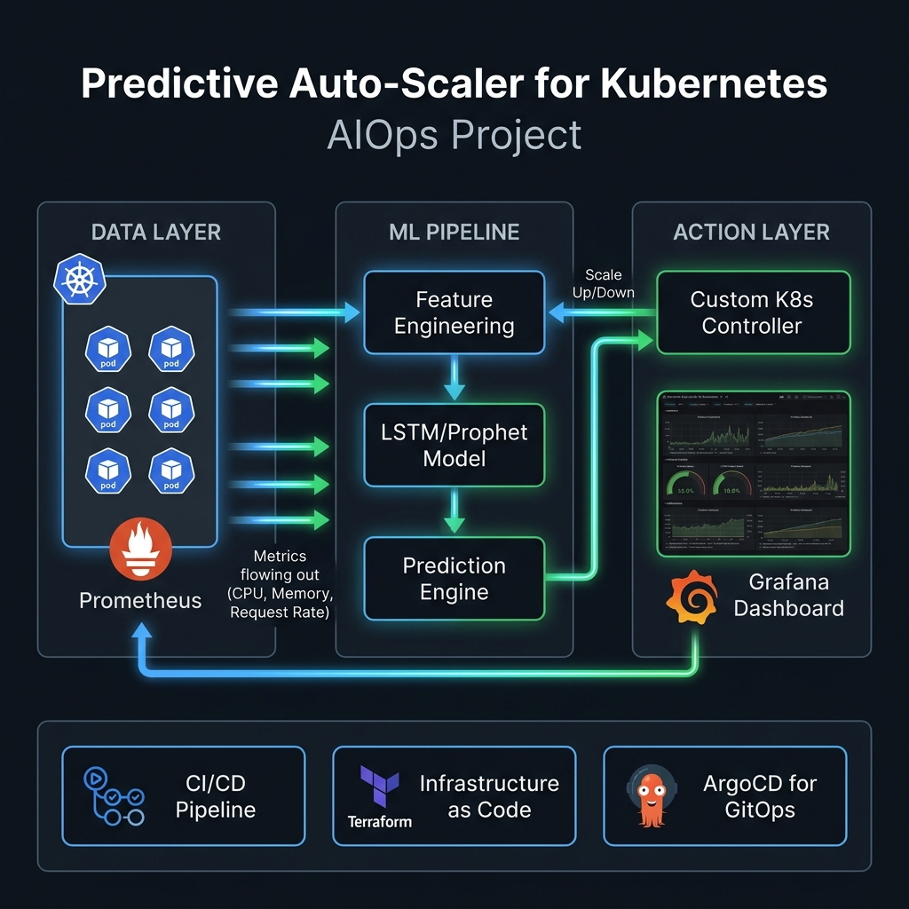
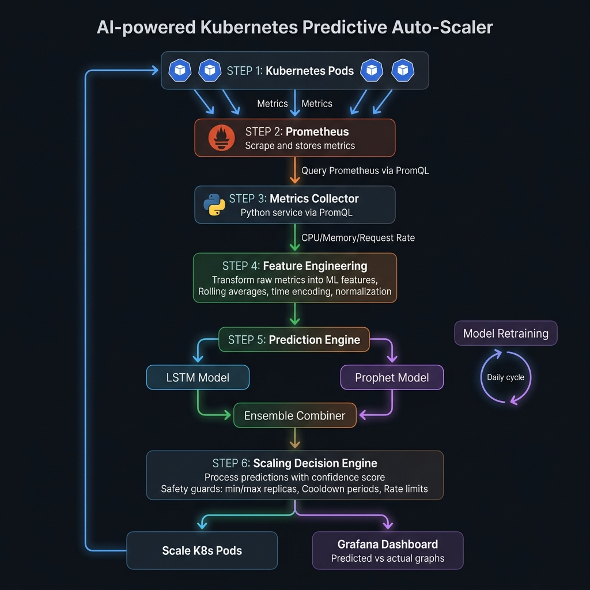

<h1 align="center">
  🔮 K8s PredictScale
</h1>

<h3 align="center">
  AI-Powered Predictive Auto-Scaler for Kubernetes
</h3>

<p align="center">
  <em>Scale before the storm hits — not after.</em>
</p>

<p align="center">
  
  
  
  
  
  
  
  
</p>

---

## 📋 Table of Contents

- [Problem Statement](#-problem-statement)
- [Solution](#-solution)
- [Architecture Overview](#-architecture-overview)
- [System Components Deep Dive](#-system-components-deep-dive)
- [Data Flow & Pipeline](#-data-flow--pipeline)
- [ML Model Architecture](#-ml-model-architecture)
- [Tech Stack](#-tech-stack)
- [Project Structure](#-project-structure)
- [Infrastructure](#-infrastructure)
- [CI/CD Pipeline](#-cicd-pipeline)
- [Getting Started](#-getting-started)
- [Roadmap](#-roadmap)
- [Contributing](#-contributing)

---

## 🎯 Problem Statement

Kubernetes' native **Horizontal Pod Autoscaler (HPA)** is **reactive** — it only scales after resource thresholds are breached. This creates:

| Problem | Impact |
|---------|--------|
| **Cold Start Latency** | New pods take 30-90s to become ready, causing degraded UX during traffic spikes |
| **Reactive Scaling** | HPA triggers *after* CPU/memory exceeds threshold — users already feel the pain |
| **Over-provisioning** | Teams set high replica counts "just in case", wasting 40-60% of cloud spend |
| **Metric Blindness** | HPA only sees current metrics, not traffic patterns or trends |
| **Cascading Failures** | Sudden spikes overwhelm pods before HPA can react, causing 5xx errors |

**Real-world example:** An e-commerce platform gets 10x traffic during flash sales. HPA starts scaling 2 minutes after the spike begins — by then, 30% of users see timeout errors.

---

## 💡 Solution

**K8s PredictScale** is an **AI-powered predictive autoscaler** that forecasts traffic patterns and **pre-scales pods before demand arrives**.

### How It's Different from HPA

```
Traditional HPA:     Traffic Spike → Threshold Breach → Scale Up → Pods Ready (2-3 min lag)
K8s PredictScale:    Predict Spike → Pre-Scale → Pods Ready → Traffic Spike (0 lag) ✅
```

### Key Capabilities

- 🔮 **Predictive Scaling** — Forecasts load 5-30 minutes ahead using LSTM neural networks
- 📊 **Multi-Signal Analysis** — Combines CPU, memory, request rate, latency, and custom metrics
- 🧠 **Continuous Learning** — Model retrains on fresh data to adapt to changing patterns
- ⚡ **Proactive + Reactive** — Works alongside HPA as a safety net, not a replacement
- 📈 **Grafana Dashboards** — Real-time visualization of predictions vs actuals
- 🔔 **Smart Alerting** — Notifies on unusual patterns, scaling events, and model drift
- 💰 **Cost Optimization** — Scales down proactively during predicted low-traffic periods

---

## 🏗️ Architecture Overview

<p align="center">
  
</p>

### High-Level Architecture

```
┌─────────────────────────────────────────────────────────────────────────────┐
│                          KUBERNETES CLUSTER (EKS)                          │
│                                                                             │
│  ┌──────────────┐    ┌──────────────┐    ┌──────────────┐                  │
│  │   App Pod 1  │    │   App Pod 2  │    │   App Pod N  │  ← Target App   │
│  └──────┬───────┘    └──────┬───────┘    └──────┬───────┘                  │
│         │                   │                   │                           │
│         └───────────────────┼───────────────────┘                           │
│                             │ metrics                                       │
│                    ┌────────▼────────┐                                      │
│                    │   PROMETHEUS    │ ◄── Scrapes metrics every 15s        │
│                    │   (Monitoring)  │                                      │
│                    └────────┬────────┘                                      │
│                             │ PromQL queries                                │
│  ┌──────────────────────────▼──────────────────────────────────────┐        │
│  │                   K8s PredictScale System                       │        │
│  │                                                                 │        │
│  │  ┌─────────────┐  ┌──────────────┐  ┌───────────────────┐     │        │
│  │  │  Collector   │→│ Preprocessor │→│  Prediction Engine │     │        │
│  │  │  Service     │  │  Pipeline    │  │  (LSTM + Prophet) │     │        │
│  │  └─────────────┘  └──────────────┘  └────────┬──────────┘     │        │
│  │                                               │                 │        │
│  │                                     ┌─────────▼──────────┐     │        │
│  │                                     │  Scaling Controller │     │        │
│  │                                     │  (Custom K8s Ctrl)  │     │        │
│  │                                     └─────────┬──────────┘     │        │
│  │                                               │                 │        │
│  │  ┌──────────────┐  ┌──────────────┐          │                 │        │
│  │  │   REST API   │  │   Grafana    │          │                 │        │
│  │  │   Server     │  │  Dashboards  │          │                 │        │
│  │  └──────────────┘  └──────────────┘          │                 │        │
│  └──────────────────────────────────────────────┼─────────────────┘        │
│                                                  │                          │
│                              ┌───────────────────▼───────┐                  │
│                              │  K8s API Server            │                  │
│                              │  (Scale Deployment/HPA)    │                  │
│                              └───────────────────────────┘                  │
└─────────────────────────────────────────────────────────────────────────────┘
```

---

## 🔍 System Components Deep Dive

### 1. Metrics Collector Service (`src/collector/`)

The **entry point** of the pipeline. Continuously scrapes Prometheus for multi-dimensional metrics.

```
┌─────────────────────────────────────────┐
│          Metrics Collector              │
│                                         │
│  ┌─────────┐    ┌──────────────────┐   │
│  │PromQL   │───►│ Metric Registry  │   │
│  │Queries  │    │                  │   │
│  └─────────┘    │ • cpu_usage      │   │
│                 │ • memory_usage   │   │
│  ┌─────────┐   │ • request_rate   │   │
│  │Schedule │   │ • response_time  │   │
│  │(15s)    │   │ • error_rate     │   │
│  └─────────┘   │ • network_io     │   │
│                 │ • custom_metrics │   │
│                 └────────┬─────────┘   │
│                          │             │
│                 ┌────────▼─────────┐   │
│                 │  Time-Series DB  │   │
│                 │  (Local Buffer)  │   │
│                 └──────────────────┘   │
└─────────────────────────────────────────┘
```

**Metrics Collected:**

| Metric | PromQL Query | Why It Matters |
|--------|-------------|----------------|
| CPU Usage | `rate(container_cpu_usage_seconds_total[5m])` | Primary scaling signal |
| Memory Usage | `container_memory_working_set_bytes` | Memory pressure detection |
| Request Rate | `rate(http_requests_total[5m])` | Traffic volume prediction |
| Response Latency (p99) | `histogram_quantile(0.99, rate(http_request_duration_seconds_bucket[5m]))` | Performance degradation signal |
| Error Rate | `rate(http_requests_total{status=~"5.."}[5m])` | Health indicator |
| Network I/O | `rate(container_network_receive_bytes_total[5m])` | Bandwidth patterns |
| Pod Ready Count | `kube_deployment_status_replicas_ready` | Current scale state |

---

### 2. Preprocessor Pipeline (`src/preprocessor/`)

Transforms raw metrics into ML-ready features through a multi-stage pipeline.

```
Raw Metrics ──► Cleaning ──► Feature Engineering ──► Normalization ──► Feature Store
                  │                  │                      │
                  ▼                  ▼                      ▼
            • Remove NaN       • Rolling averages      • Min-Max scaling
            • Interpolate      • Rate of change        • Z-score norm
            • Outlier clip     • Seasonality features   • Sequence windowing
                               • Lag features
                               • Day/hour encoding
```

**Feature Engineering Details:**

| Feature | Description | Window |
|---------|-------------|--------|
| `cpu_rolling_mean` | Rolling average of CPU usage | 5m, 15m, 1h |
| `cpu_rate_of_change` | First derivative of CPU trend | 5m |
| `request_rate_delta` | Change in request rate | 1m |
| `hour_sin`, `hour_cos` | Cyclical time encoding | - |
| `day_of_week` | One-hot encoded weekday | - |
| `lag_cpu_15m` | CPU value 15 minutes ago | 15m |
| `lag_cpu_1h` | CPU value 1 hour ago | 1h |
| `ema_request_rate` | Exponential moving average of requests | 30m |

---

### 3. Prediction Engine (`src/predictor/`)

The **brain** of the system. Uses an ensemble of LSTM and Prophet models for robust forecasting.

```
┌────────────────────────────────────────────────────────────┐
│                    Prediction Engine                        │
│                                                            │
│  ┌──────────────────┐     ┌──────────────────┐            │
│  │   LSTM Model     │     │  Prophet Model   │            │
│  │                  │     │                  │            │
│  │  Input: 60 steps │     │  Input: Raw TS   │            │
│  │  Hidden: 128     │     │  Seasonality:    │            │
│  │  Layers: 2       │     │   • Daily        │            │
│  │  Dropout: 0.2    │     │   • Weekly       │            │
│  │  Output: 10 steps│     │  Holidays: Yes   │            │
│  └────────┬─────────┘     └────────┬─────────┘            │
│           │                        │                       │
│           ▼                        ▼                       │
│  ┌─────────────────────────────────────────────┐          │
│  │           Ensemble Combiner                  │          │
│  │                                              │          │
│  │  weighted_pred = α × LSTM + (1-α) × Prophet │          │
│  │  confidence = calculate_uncertainty()        │          │
│  │  α adjusted dynamically based on MAE         │          │
│  └──────────────────┬──────────────────────────┘          │
│                     │                                      │
│           ┌─────────▼──────────┐                          │
│           │ Prediction Output  │                          │
│           │                    │                          │
│           │ • predicted_load   │                          │
│           │ • confidence_band  │                          │
│           │ • recommended_pods │                          │
│           │ • scaling_urgency  │                          │
│           └────────────────────┘                          │
└────────────────────────────────────────────────────────────┘
```

**LSTM Architecture:**

```
Input (60 timesteps × 8 features)
         │
    ┌────▼────┐
    │ LSTM-1  │  128 units, return_sequences=True
    │ + BN    │  Batch Normalization
    │ + Drop  │  Dropout(0.2)
    └────┬────┘
         │
    ┌────▼────┐
    │ LSTM-2  │  64 units, return_sequences=False
    │ + BN    │  Batch Normalization
    │ + Drop  │  Dropout(0.2)
    └────┬────┘
         │
    ┌────▼────┐
    │ Dense   │  32 units, ReLU
    └────┬────┘
         │
    ┌────▼────┐
    │ Dense   │  10 units (10 future steps × 1 metric)
    └─────────┘

Output: Next 10 timesteps prediction (5-30 min ahead)
```

---

### 4. Scaling Controller (`src/controller/`)

The **decision maker** — converts predictions into actual Kubernetes scaling actions.

```
┌──────────────────────────────────────────────────────────────────┐
│                     Scaling Controller                            │
│                                                                  │
│  Prediction ──► ┌──────────────────┐                             │
│                 │ Decision Engine  │                             │
│                 │                  │                             │
│                 │ 1. Calculate     │                             │
│                 │    target_pods   │                             │
│  Current    ──► │ 2. Apply safety  │ ──► K8s API                │
│  State          │    bounds        │     (PATCH deployment)     │
│                 │ 3. Rate limiting │                             │
│  Config     ──► │ 4. Cooldown      │ ──► Metrics                │
│                 │    check         │     (scaling_events)       │
│                 │ 5. Confidence    │                             │
│                 │    threshold     │ ──► Alerts                  │
│                 └──────────────────┘     (Slack/PagerDuty)      │
│                                                                  │
│  Safety Mechanisms:                                              │
│  ├── min_replicas: 2          (never scale below)               │
│  ├── max_replicas: 50         (never scale above)               │
│  ├── scale_up_rate: +5/min    (max pods added per minute)       │
│  ├── scale_down_rate: -2/min  (max pods removed per minute)     │
│  ├── cooldown_period: 120s    (wait between scaling events)     │
│  ├── confidence_threshold: 0.7 (minimum confidence to act)      │
│  └── dry_run_mode: true       (log only, don't scale)          │
└──────────────────────────────────────────────────────────────────┘
```

**Scaling Formula:**

```python
target_replicas = ceil(predicted_load / target_utilization_per_pod)
target_replicas = max(min_replicas, min(max_replicas, target_replicas))
target_replicas = apply_rate_limiting(current_replicas, target_replicas)

# Only scale if confidence > threshold
if prediction_confidence >= 0.7:
    apply_scaling(target_replicas)
else:
    log_warning("Low confidence prediction, deferring to HPA")
```

---

### 5. REST API Server (`src/api/`)

Exposes endpoints for monitoring, configuration, and manual control.

| Endpoint | Method | Description |
|----------|--------|-------------|
| `/api/v1/health` | GET | Health check |
| `/api/v1/predictions` | GET | Current predictions & confidence |
| `/api/v1/predictions/history` | GET | Historical predictions vs actuals |
| `/api/v1/metrics` | GET | Prometheus-format metrics export |
| `/api/v1/config` | GET/PUT | View/update scaling configuration |
| `/api/v1/model/status` | GET | Model training status & accuracy |
| `/api/v1/model/retrain` | POST | Trigger manual model retraining |
| `/api/v1/scaling/events` | GET | History of scaling decisions |
| `/api/v1/scaling/dry-run` | POST | Simulate a scaling decision |

---

### 6. Grafana Dashboards (`config/grafana/`)

Three purpose-built dashboards:

**Dashboard 1: Predictions Overview**
- Predicted vs actual CPU/request rate (overlay chart)
- Confidence bands visualization
- Prediction accuracy (MAE, RMSE) trending

**Dashboard 2: Scaling Activity**
- Scaling events timeline
- Pods count over time (predicted vs actual)
- Cost savings estimation
- HPA vs PredictScale comparison

**Dashboard 3: Model Performance**
- Training loss curves
- Feature importance
- Model drift detection
- Retraining triggers log

---

## 🔄 Data Flow & Pipeline

<p align="center">
  
</p>

### End-to-End Pipeline (Every 60 seconds)

```
┌──────┐     ┌───────────┐     ┌──────────────┐     ┌───────────┐     ┌──────────┐
│Prom- │────►│ Collector │────►│ Preprocessor │────►│ Predictor │────►│Controller│
│etheus│     │           │     │              │     │           │     │          │
│      │     │ • Query   │     │ • Clean      │     │ • LSTM    │     │ • Decide │
│      │     │ • Buffer  │     │ • Engineer   │     │ • Prophet │     │ • Scale  │
│      │     │ • Validate│     │ • Normalize  │     │ • Ensemble│     │ • Alert  │
└──────┘     └───────────┘     └──────────────┘     └───────────┘     └──────────┘
                                                                            │
                                                                            ▼
                                                                     ┌──────────┐
                                                                     │ K8s API  │
                                                                     │ Server   │
                                                                     └──────────┘
```

### Model Training Pipeline (Daily)

```
┌───────────┐     ┌──────────────┐     ┌───────────┐     ┌──────────┐
│Historical │────►│   Feature    │────►│   Train   │────►│ Evaluate │
│Metrics DB │     │ Engineering  │     │ LSTM +    │     │ & Deploy │
│(7-30 days)│     │              │     │ Prophet   │     │          │
└───────────┘     └──────────────┘     └───────────┘     └──────────┘
                                                               │
                                            ┌──────────────────┤
                                            ▼                  ▼
                                     ┌────────────┐   ┌──────────────┐
                                     │ Model      │   │ If MAE > thr │
                                     │ Registry   │   │ → Alert      │
                                     │ (versioned)│   │ → Rollback   │
                                     └────────────┘   └──────────────┘
```

---

## 🧠 ML Model Architecture

### Why LSTM + Prophet Ensemble?

| Aspect | LSTM | Prophet | Ensemble Benefit |
|--------|------|---------|-----------------|
| Short-term patterns | ⭐⭐⭐⭐⭐ | ⭐⭐⭐ | Best of both |
| Seasonality | ⭐⭐⭐ | ⭐⭐⭐⭐⭐ | Captures all patterns |
| Anomaly handling | ⭐⭐⭐⭐ | ⭐⭐ | Robust to outliers |
| Training speed | ⭐⭐ | ⭐⭐⭐⭐⭐ | Prophet as fallback |
| Cold start | ⭐ | ⭐⭐⭐⭐ | Prophet bootstraps |
| Multivariate | ⭐⭐⭐⭐⭐ | ⭐⭐ | LSTM handles correlations |

### Training Strategy

```
Phase 1 (Days 1-3):    Prophet-only (works with limited data)
Phase 2 (Days 3-7):    LSTM begins training, Prophet still primary
Phase 3 (Day 7+):      Ensemble mode, weights adjusted by validation MAE
Phase 4 (Ongoing):     Continuous retraining with sliding window
```

### Model Performance Targets

| Metric | Target | Description |
|--------|--------|-------------|
| MAE | < 10% | Mean Absolute Error of predicted vs actual CPU |
| Prediction Horizon | 5-30 min | How far ahead we predict |
| Inference Latency | < 100ms | Time to generate prediction |
| Retraining Frequency | Daily | Full model retrain cycle |
| Minimum Data Required | 72 hours | Before LSTM activates |

---

## 🛠️ Tech Stack

### Core Application

| Component | Technology | Purpose |
|-----------|-----------|---------|
| Language | Python 3.11+ | Main application language |
| ML Framework | TensorFlow/Keras | LSTM model training & inference |
| Forecasting | Prophet | Time-series forecasting |
| Data Processing | Pandas, NumPy | Feature engineering & data manipulation |
| API Server | FastAPI | REST API for monitoring & control |
| Metrics Client | prometheus-client | Export custom metrics |
| K8s Client | kubernetes (Python) | Interact with K8s API |
| Task Scheduler | APScheduler | Periodic collection & prediction jobs |

### Infrastructure & DevOps

| Component | Technology | Purpose |
|-----------|-----------|---------|
| Container Runtime | Docker | Application containerization |
| Orchestration | Kubernetes (EKS) | Container orchestration |
| IaC | Terraform | AWS infrastructure provisioning |
| Monitoring | Prometheus + Grafana | Metrics collection & visualization |
| GitOps | ArgoCD | Continuous deployment |
| CI/CD | GitHub Actions | Build, test, and deploy pipeline |
| Registry | Amazon ECR | Container image registry |
| Secrets | AWS Secrets Manager | Sensitive configuration |

---

## 📁 Project Structure

```
k8s-predictscale/
├── src/                          # Application source code
│   ├── collector/                # Prometheus metrics collector
│   │   ├── __init__.py
│   │   ├── prometheus_client.py  # PromQL query executor
│   │   ├── metric_registry.py   # Metric definitions & schemas
│   │   └── collector_service.py  # Main collection orchestrator
│   │
│   ├── preprocessor/             # Feature engineering pipeline
│   │   ├── __init__.py
│   │   ├── cleaner.py            # Data cleaning & validation
│   │   ├── feature_engineer.py   # Feature extraction & transformation
│   │   ├── normalizer.py         # Scaling & normalization
│   │   └── pipeline.py           # Orchestrates preprocessing stages
│   │
│   ├── predictor/                # ML prediction engine
│   │   ├── __init__.py
│   │   ├── lstm_model.py         # LSTM model definition & training
│   │   ├── prophet_model.py      # Prophet model wrapper
│   │   ├── ensemble.py           # Ensemble combiner & weighting
│   │   ├── model_manager.py      # Model versioning & lifecycle
│   │   └── predictor_service.py  # Prediction orchestrator
│   │
│   ├── controller/               # Kubernetes scaling controller
│   │   ├── __init__.py
│   │   ├── decision_engine.py    # Scaling decision logic
│   │   ├── k8s_scaler.py         # K8s API interaction
│   │   ├── safety_guard.py       # Rate limiting & safety bounds
│   │   └── controller_service.py # Main controller loop
│   │
│   ├── api/                      # REST API server
│   │   ├── __init__.py
│   │   ├── main.py               # FastAPI application
│   │   ├── routes/               # API route handlers
│   │   └── schemas.py            # Request/response models
│   │
│   └── utils/                    # Shared utilities
│       ├── __init__.py
│       ├── config.py             # Configuration management
│       ├── logger.py             # Structured logging setup
│       └── alerts.py             # Alert/notification helpers
│
├── models/                       # Saved model artifacts
│   └── .gitkeep
│
├── config/                       # Configuration files
│   ├── prometheus/               # Prometheus scrape configs
│   │   └── rules.yml
│   ├── grafana/                  # Grafana provisioning
│   │   └── dashboards/
│   └── helm/                     # Helm chart for deployment
│       └── predictscale/
│           ├── Chart.yaml
│           ├── values.yaml
│           └── templates/
│
├── manifests/                    # Raw K8s manifests
│   ├── base/                     # Base Kustomize resources
│   └── overlays/                 # Environment-specific overlays
│       ├── dev/
│       ├── staging/
│       └── prod/
│
├── terraform/                    # Infrastructure as Code
│   ├── modules/
│   │   ├── eks/                  # EKS cluster module
│   │   ├── vpc/                  # VPC & networking module
│   │   └── monitoring/           # Prometheus & Grafana module
│   └── environments/
│       ├── dev/
│       └── prod/
│
├── notebooks/                    # Jupyter notebooks for exploration
│   └── .gitkeep
│
├── tests/                        # Test suite
│   ├── unit/                     # Unit tests
│   ├── integration/              # Integration tests
│   └── e2e/                      # End-to-end tests
│
├── scripts/                      # Utility scripts
│   └── .gitkeep
│
├── docs/                         # Documentation
│   ├── architecture/
│   └── images/
│       └── architecture-overview.png
│
├── .github/
│   └── workflows/                # GitHub Actions CI/CD
│
├── Dockerfile                    # Container build
├── docker-compose.yml            # Local development stack
├── requirements.txt              # Python dependencies
├── pyproject.toml                # Project metadata
├── Makefile                      # Common development commands
├── .gitignore                    # Git ignore rules
├── .env.example                  # Environment variable template
└── README.md                     # This file
```

---

## ☁️ Infrastructure

### AWS Architecture

```
┌─────────────────────────────────────────────────────────────┐
│                        AWS Cloud                             │
│                                                              │
│  ┌──────────────────────────────────────────────────────┐   │
│  │                    VPC (10.0.0.0/16)                  │   │
│  │                                                       │   │
│  │  ┌─────────────┐  ┌─────────────┐  ┌─────────────┐  │   │
│  │  │ Public Sub  │  │ Public Sub  │  │ Public Sub  │  │   │
│  │  │ us-east-1a  │  │ us-east-1b  │  │ us-east-1c  │  │   │
│  │  │ NAT + ALB   │  │             │  │             │  │   │
│  │  └─────────────┘  └─────────────┘  └─────────────┘  │   │
│  │                                                       │   │
│  │  ┌─────────────┐  ┌─────────────┐  ┌─────────────┐  │   │
│  │  │ Private Sub │  │ Private Sub │  │ Private Sub │  │   │
│  │  │ us-east-1a  │  │ us-east-1b  │  │ us-east-1c  │  │   │
│  │  │ EKS Workers │  │ EKS Workers │  │ EKS Workers │  │   │
│  │  └─────────────┘  └─────────────┘  └─────────────┘  │   │
│  │                                                       │   │
│  │              ┌─────────────────────┐                  │   │
│  │              │    EKS Cluster      │                  │   │
│  │              │  ┌───────────────┐  │                  │   │
│  │              │  │ PredictScale  │  │                  │   │
│  │              │  │ Prometheus    │  │                  │   │
│  │              │  │ Grafana       │  │                  │   │
│  │              │  │ ArgoCD        │  │                  │   │
│  │              │  │ Target Apps   │  │                  │   │
│  │              │  └───────────────┘  │                  │   │
│  │              └─────────────────────┘                  │   │
│  └──────────────────────────────────────────────────────┘   │
│                                                              │
│  ┌──────────┐  ┌──────────┐  ┌──────────┐                  │
│  │   ECR    │  │ Secrets  │  │   S3     │                  │
│  │ (Images) │  │ Manager  │  │ (Models) │                  │
│  └──────────┘  └──────────┘  └──────────┘                  │
└─────────────────────────────────────────────────────────────┘
```

### Terraform Modules

| Module | Resources Created |
|--------|-------------------|
| `vpc` | VPC, Subnets, NAT Gateway, Route Tables, Security Groups |
| `eks` | EKS Cluster, Node Groups, IAM Roles, OIDC Provider |
| `monitoring` | Prometheus (Helm), Grafana (Helm), Alert Manager |

---

## 🔄 CI/CD Pipeline

```
┌──────────┐    ┌───────────┐    ┌──────────┐    ┌──────────┐    ┌──────────┐
│  Push to │───►│  GitHub   │───►│  Build & │───►│  Push to │───►│ ArgoCD   │
│  main    │    │  Actions  │    │  Test    │    │  ECR     │    │ Sync     │
└──────────┘    └───────────┘    └──────────┘    └──────────┘    └──────────┘
                     │                │                                │
                     ▼                ▼                                ▼
              • Lint (flake8)   • Unit tests                   • Auto-deploy
              • Type check      • Integration tests             to dev
              • Security scan   • Model validation             • Manual gate
                                                                 for prod
```

### Pipeline Stages

1. **Code Quality** — Linting, type checking, security scanning
2. **Test** — Unit tests, integration tests, model validation
3. **Build** — Docker image build with multi-stage Dockerfile
4. **Push** — Tag and push to Amazon ECR
5. **Deploy** — ArgoCD detects new image, syncs to cluster

---

## 🚀 Getting Started

### Prerequisites

- Python 3.11+
- Docker & Docker Compose
- kubectl & Helm
- AWS CLI (configured)
- Terraform 1.5+

### Option 1: Local Docker Compose (Testing & Development)

```bash
# Clone the repository
git clone https://github.com/<your-username>/k8s-predictscale.git
cd k8s-predictscale

# This boots up Prometheus, Grafana, a dummy NGINX deployment, and the core PredictScale AI engine
make docker-up

# Now watch the AI engine detect baselines and start scaling!
make docker-logs
```

### Option 2: Actual Kubernetes Cluster (Production/Staging)

If you deploy the `terraform/` templates to AWS to spin up your EKS cluster, you simply deploy the engine onto the cluster:

```bash
# Deploys the application with your production thresholds and topologies
kubectl apply -k manifests/overlays/prod

# Or via Helm
helm install predictscale ./config/helm/predictscale --namespace predictscale --create-namespace
```

### Option 3: Simulating Traffic & Testing Models

Powerful utility scripts are available to test the AI outside of a live cluster. Once you're on a machine with Python dependencies installed, you can train and validate the algorithms manually:

```bash
# Set up Python environment
python -m venv venv
source venv/bin/activate
pip install -r requirements.txt

# Generate 14 days of realistic website traffic / server load
python3 scripts/generate_synthetic_data.py --hours 336 --output data.csv

# Train the LSTM/Prophet algorithms locally on that data to tune weights
python3 scripts/train_model.py --data data.csv

# Run the live scaling API stressor against an active URL
python3 scripts/load_test.py --mode spike --url http://localhost:8080
```

---

## 🗺️ Roadmap

### Phase 1: Foundation (Week 1-2)
- [x] Project structure & architecture design
- [ ] Metrics collector service
- [ ] Data preprocessing pipeline
- [ ] Local development environment (Docker Compose)

### Phase 2: ML Pipeline (Week 3-4)
- [ ] LSTM model implementation
- [ ] Prophet model implementation
- [ ] Ensemble combiner
- [ ] Model training pipeline
- [ ] Jupyter notebooks for experimentation

### Phase 3: Controller & API (Week 5)
- [ ] Scaling decision engine
- [ ] Kubernetes scaler integration
- [ ] Safety guards & rate limiting
- [ ] REST API server
- [ ] Grafana dashboards

### Phase 4: Infrastructure & Deployment (Week 6)
- [ ] Terraform modules (VPC, EKS, Monitoring)
- [ ] Helm chart creation
- [ ] CI/CD pipeline (GitHub Actions)
- [ ] ArgoCD setup
- [ ] Kustomize overlays

### Phase 5: Testing & Optimization (Week 7-8)
- [ ] Unit & integration tests
- [ ] End-to-end testing with load generation
- [ ] Model accuracy benchmarking
- [ ] Performance tuning
- [ ] Documentation & demo video

---

## 🤝 Contributing

Contributions are welcome! Please read the contributing guidelines before submitting a PR.

1. Fork the repository
2. Create a feature branch (`git checkout -b feature/amazing-feature`)
3. Commit your changes (`git commit -m 'Add amazing feature'`)
4. Push to the branch (`git push origin feature/amazing-feature`)
5. Open a Pull Request

---

## 📝 License

This project is licensed under the MIT License - see the [LICENSE](LICENSE) file for details.

---

<p align="center">
  Built with ❤️ for the AIOps community
</p>
